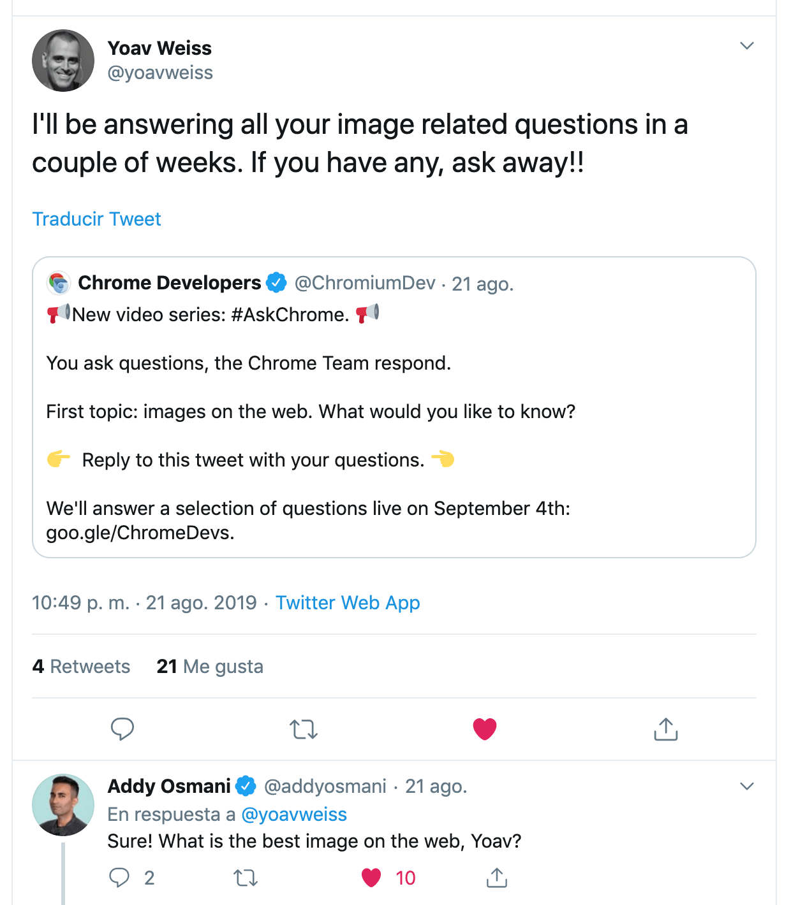
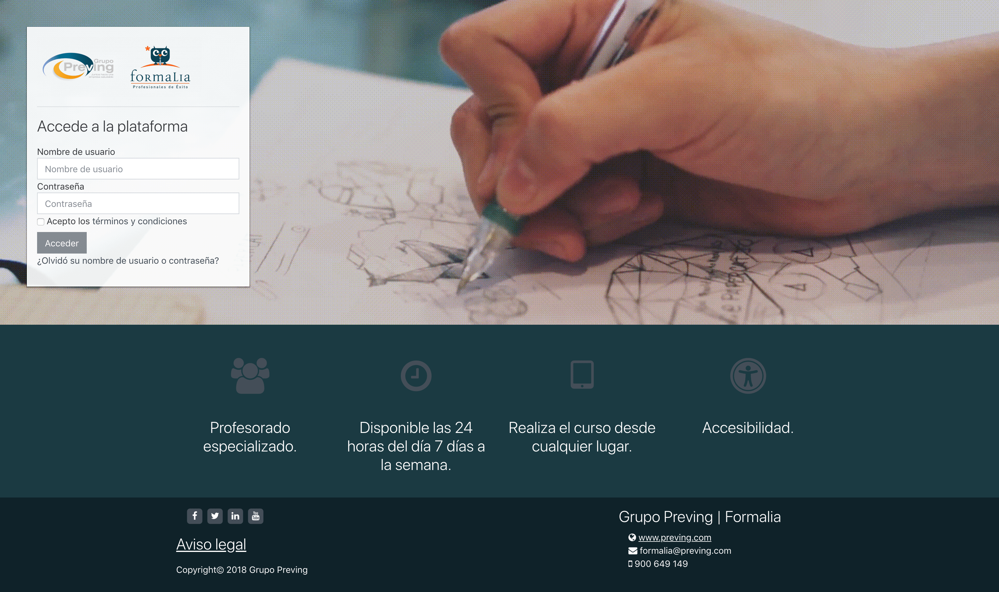
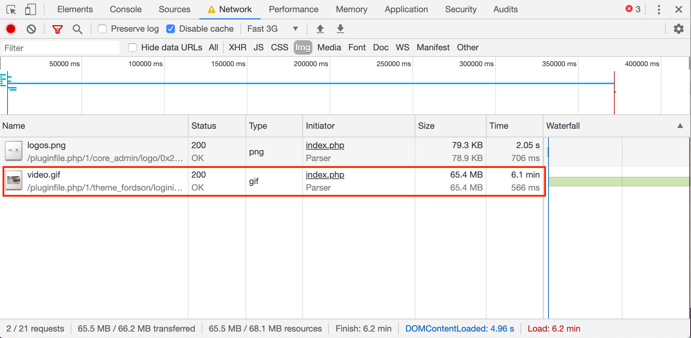
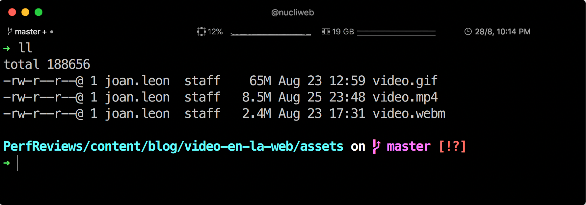

Después de este tweet de [Yoav Weiss](https://twitter.com/yoavweiss) en el que [Addy Osmani](https://twitter.com/addyosmani) le pregunta por la “mejor” imagen de la web.



[Rick Viscomi](https://twitter.com/rick_viscomi) es un ingeniero de Google que actualmente está trabajando en un interesante proyecto llamado "The State of the Web". Para esta iniciativa, Rick está ejecutando cientos de consultas con [BigQuery](https://cloud.google.com/bigquery/) contra el dataset de [HTTP Archive](https://httparchive.org), y responde a Addy con el siguiente tweet:


Rick muestra la consulta SQL que ha hecho a la tabla de la base de datos con los datos de HTTP Archive del mes de julio.

La “mejor” imagen de la web actualmente es un archivo en formato GIF, video.gif. Como su nombre indica, se trata de un vídeo de 11 segundos y con un tamaño de más de **65Mb**.

Sí, nos pudo la curiosidad 😊

Así que empezamos a hacer eso que tanto nos gusta hacer, investigar para conseguir encontrar el problema y su posible solución.

## Problema

Al ver la url de la imagen, lo primero que podemos ver es que se trata de un [Moodle](https://moodle.org), una plataforma de aprendizaje en línea utilizada por muchas escuelas de todo el mundo.

Al entrar en la dirección [moodle.e-formalia.es](https://moodle.e-formalia.es) nos encontramos con una página de acceso a la plataforma, y ahí es donde encontramos el tan pesado GIF.



El servidor nos está sirviendo dos imágenes: logos.png y video.gif. El tiempo de carga de ese vídeo de fondo en la pantalla de acceso, desde una conexión de fibra óptica de **600Mb** es de tan sólo **2.67 segundos**.


Pero veamos qué pasa si utilizamos la funcionalidad del panel de red de las Developer Tools para simular una conexión más lenta. Seleccionamos la configuración de 3G rápida, que se acerca más a la experiencia de carga en móvil.



Hemos tenido que esperar **6.1 minutos** para que se descargara el 100% del vídeo.

## Solución

No es una novedad que el mejor formato para cargar un vídeo en la web es un fichero de vídeo como **MP4**, en lugar de una imagen con soporte de animación como el formato GIF.

Hay otros formatos de imagen con soporte de animación, como **WebM**. También existe el formato **APNG**. Este formato, que no es nuevo pero es muy desconocido, es una versión de PNG con soporte para animaciones. Recientemente lo compartía Joan en [este tweet](https://twitter.com/nucliweb/status/1163537269007032320).

Para aprender sobre el uso de utilizar Vídeo en lugar de GIF, podemos hacer uso de una de las base de documentación de buenas prácticas, optimización y rendimiento web que tenemos disponible, **Web Fundamentals**. En este sitio web encontraremos un artículo específico sobre este tema [Replace Animated GIFs with Video](https://developers.google.com/web/fundamentals/performance/optimizing-content-efficiency/replace-animated-gifs-with-video/).

En el artículo nos sugieren una herramienta de compresión de vídeo, [FFmpeg](https://ffmpeg.org). Se trata de una herramienta muy potente y versátil, con muchísimas funcionalidades, plugins y configuraciones posibles. Pero vamos a hacerlo fácil, centrándonos en las sugerencias que nos hace Google en artículo mencionado.

### MPEG-4

Después de la instalación, en nuestro caso algo tan simple como `brew install ffmpeg` en Mac, ejecutamos `ffmpeg -i video.gif video.mp4` y después de unos pocos segundos podemos ver que el archivo **video.gif** de **65Mb** se ha convertido en **video.mp4** de tan sólo 6.6MB. En el artículo nos muestran algunos parámetros de FFmpeg que nos dan opción de optimizar la conversión desde el punto de vista de peso y de calidad.

Podemos ajustar el parámetro [CRF](https://trac.ffmpeg.org/wiki/Encode/H.264) que nos permite definir el nivel de pérdida de calidad. Tras algunas pruebas, optamos por definir el CRT a 22, un punto por debajo del valor por defecto, con la intención de ser lo más fieles posibles a la calidad que nos hemos encontrado con el fichero original.

```sh
ffmpeg -i video.gif -b:v 0 -crf 22 video.mp4
```

Esto nos deja un archivo de **8.5Mb**, reduciendo su peso a un 13% del original.

### WebM

Otro formato de vídeo es **WebM**, la versión para vídeos de **WebP**, el formato de imagen con pérdida sugerido por Google. El formato WebM tiene un gran soporte por los navegadores, como podemos ver en [Can I Use](https://caniuse.com/#search=webm).

Después de hacer algunas pruebas ajustando  el valor de CRF, lo establecemos al valor sugerido por Google, 41:

```sh
ffmpeg -i video.gif -c vp9 -b:v 0 -crf 41 video.webm
```

Sorprendentemente obtenemos un vídeo de una calidad muy aceptable con un tamaño de sólo **2.4Mb**.

### &lt;video&gt;

A la hora de implementar estos formatos, y para dar soporte a todos los navegadores, añadiremos múltiples sources a una etiqueta vídeo:

```html
<video autoplay loop muted playsinline>
  <source src="video.webm" type="video/webm">
  <source src="video.mp4" type="video/mp4">
</video>
```

Esto permite servir el archivo **video.webm** para los navegadores que soporten WebM y **video.mp4** para el resto.

## Resultado



Os dejamos enlace a los ficheros para que podáis evaluar los resultados de calidad, así como sus tamaños.

- [video.gif (65Mb)](./assets/video.gif)
- [video.mp4 (8,5Mb)](./assets/video.mp4)
- [video.webm (2,4Mb)](./assets/video.webm)

## Conclusión

Hemos visto cómo podemos mejorar el rendimiento de esta página con unos simples pasos. Pero lo que realmente deberíamos valorar es el impacto en la experiencia de usuario, dado que este vídeo se muestra en la página de login, una funcionalidad crítica.

En el caso de que un usuario acceda desde móvil, podríamos presentar una imagen en lugar de un vídeo, ya que en la mayoría de casos estará navegado en una red de datos.

Somos conscientes de que más del 90% de usuarios accederán a la siguiente pantalla antes de que haya descargado el 100% del GIF, pero hemos de ser responsables con el consumo de datos de los usuarios cuando acceden a nuestras webs o aplicaciones.
