The recent Google I/O 2019 was an event full of new ideas related to web performance that will make it easier to find and solve performance problems.

This is a non-exhaustive list of the new tools and features that were presented.

## LightWallet

_Presented in [Speed at Scale: Web Performance Tips and Tricks from the Trenches](https://youtu.be/YJGCZCaIZkQ?t=101). Also mentioned in [Demystifying Speed Tooling](https://www.youtube.com/watch?v=mLjxXPHuIJo?t=73)._

[LightWallet](https;//bit.ly/lightwallet-docs) adds support for _performance budgets_ in Lighthouse and is available in the Lighthouse command-line version.


LightWallet adds a "Budgets" section in the Lighthouse report. This section groups the resources of the page and shows in red how much we are exceeding the threshold in terms of requests and/or kBs.

This makes it ideal for Continuous Integration environments. To configure it, simply add a `budget.json` file that defines the performance budgets.

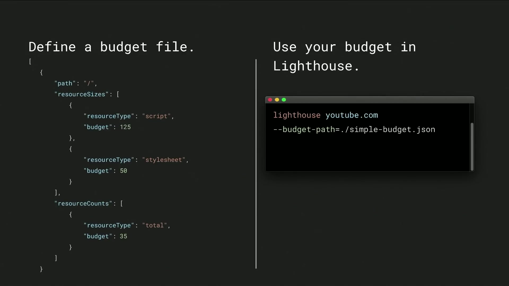

## Lighthouse Stack Packs

_Presented in [Demystifying Speed Tooling](https://www.youtube.com/watch?v=mLjxXPHuIJo?t=330)._

Lighthouse provides developers with advice on how to improve websites by analyzing performance, accessibility and good practices.

Many developers today use different technologies (backend / CMS / JavaScript frameworks) to build their websites. Instead of showing general recommendations, what would happen if Lighthouse could also provide more relevant and useful advice based on the tools used to build the site? For instance, recommending a specific Wordpress plugin to improve the performance of a site that uses Wordpress.

Lighthouse can now detect which platform a website uses and offer specific tips to improve performance through [Stack Packs](https://github.com/GoogleChrome/lighthouse-stack-packs).

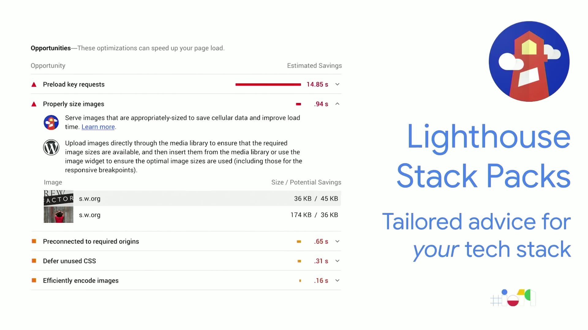

## Lighthouse Plugins

_Presented in [Demystifying Speed Tooling](https://www.youtube.com/watch?v=mLjxXPHuIJo?t=2000)._

Lighthouse plugins allow extending Lighthouse functionality for specific needs.


The plugins are NPM modules that implement a series of checks that are executed by Lighthouse and added as an additional section. An example is the [Publisher Ads plugin](https://github.com/googleads/pub-ads-lighthouse-plugin) (formerly called AdSpeed) that Google has developed to improve the integration with their ad platform.

In addition, it will soon be possible to choose which plugins to run from the DevTools.

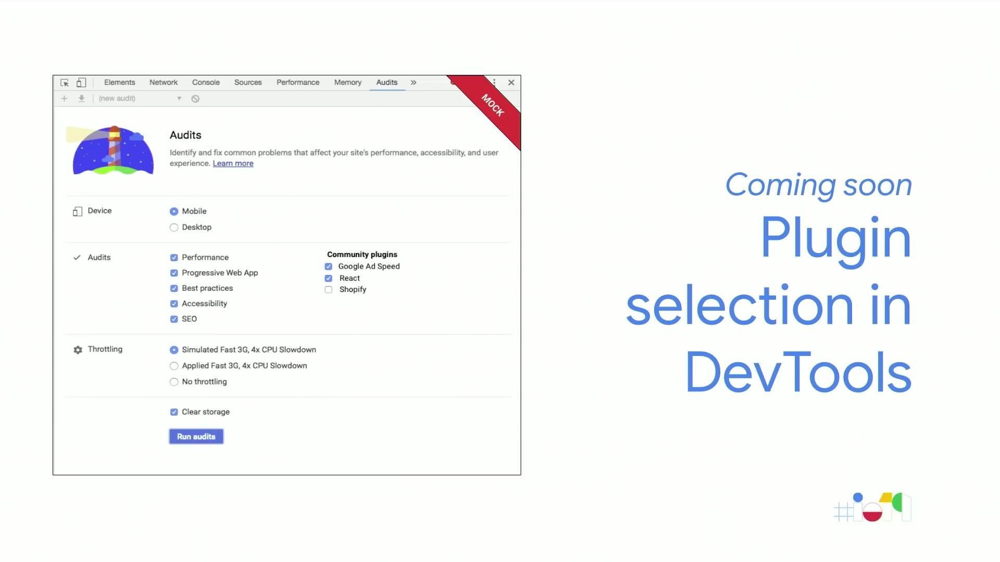

## New design for Lighthouse

_Presented in [Demystifying Speed Tooling](https://www.youtube.com/watch?v=mLjxXPHuIJo?t=391)._

The design of the Lighthouse report has changed slightly and now also includes support for _dark mode_.

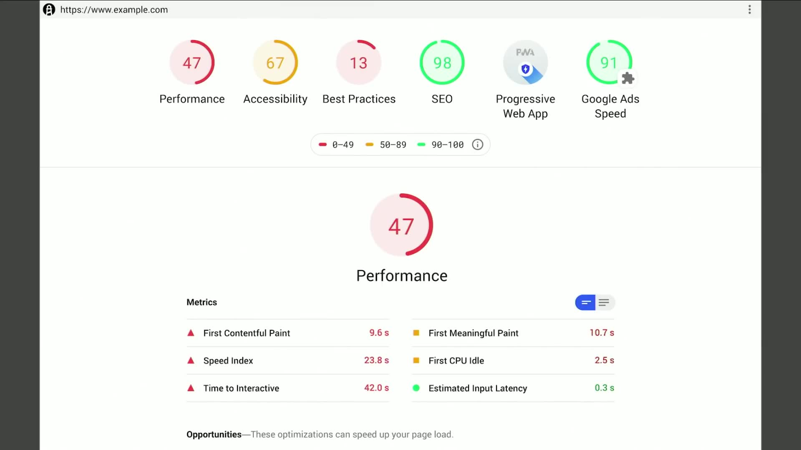

## Evergreen Googlebot

_Presented in [Google Search and JavaScript Sites](https://www.youtube.com/watch?v=Ey0N1Ry0BPM)._

The bot that Google uses to index sites was still running Chrome 41, a version that had been released in March 2015. From now on, it will be updated to run the latest version of Chrome. This means that Googlebot now supports features like [IntersectionObserver and ES6](https://webmasters.googleblog.com/2019/05/the-new-evergreen-googlebot.html), which were not available in Chrome 41.

One positive aspect of Googlebot running Chrome 41 was that developers had to add support for older browsers to get their content properly indexed. The Googlebot update does not mean that we no longer have to worry about these browsers, since we must always strive to give the user a good experience regardless of the browser they use.

Two things to keep in mind is that test tools like [Google Search Console](https://search.google.com/search-console) still run Chrome 41 and will be updated in the future. Also, although Googlebot will not run Chrome 41, it will continue to advertise that version in its user agent temporarily. This will give web developers time to make changes to their code in case they were doing _user agent sniffing_ assuming the bot was advertised as Chrome 41.

Serving ES6 and using IntersectionObserver will help reduce data traffic, and will probably shorten load times. This is excellent for the user experience, but also for SEO, since Google uses the loading time as one of the metrics to rank the sites.

## New performance metrics

_Presented in [Demystifying Speed Tooling](https://www.youtube.com/watch?v=mLjxXPHuIJo?t=575)._

Two new metrics are added to the already known FP, FCP, FID and TTI:

- **[Layout stability](https://bit.ly/layout-stability)**, which measures the changes in the layout when loading content that _pushes_ other elements and forces the browser to recalculate their position.
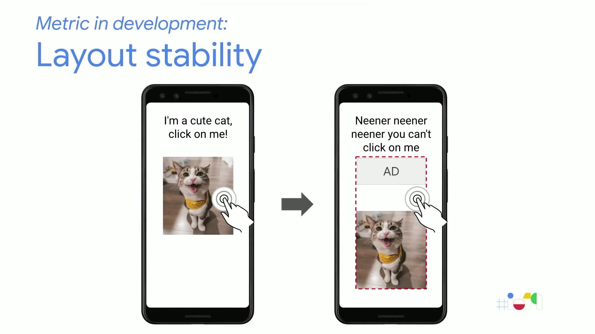

- **Largest Contentful Paint**, which measures when the largest element is rendered, which serves as an approximation to the main content of the page. It is a generalization of metrics used in the past to measure the loading of a "Hero Image".
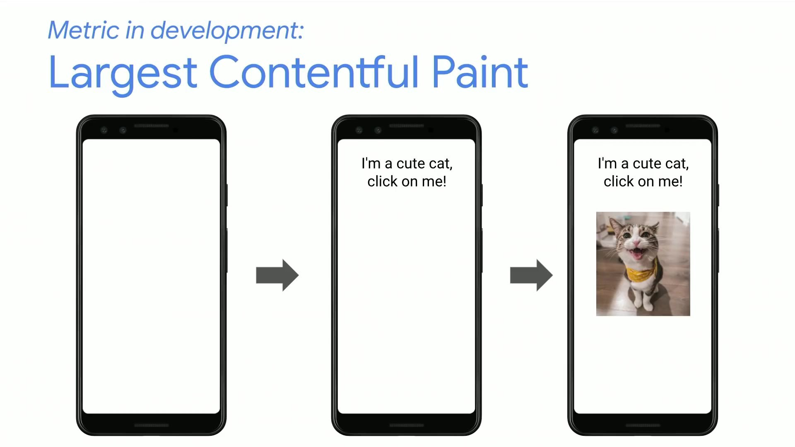

## Element Timing for Images

_Presented in [Demystifying Speed Tooling](https://www.youtube.com/watch?v=mLjxXPHuIJo?t=1877)._

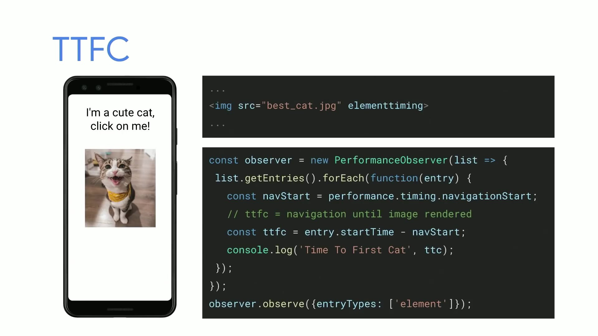

Now we can get the loading time of images using the attribute `elementtiming`, which exposes metrics that can be accessed through` PerformanceObserver`. This can be used to track a custom metric that helps us measure the performance of our page. An example of custom metric comes from Wikimedia, which [they wanted to measure the "time-to-logo"](https://phabricator.wikimedia.org/phame/post/view/19/improving_time-to-logo_performance_with_preload_links/).

## Native Lazy Loading

_Presented in [Speed at Scale: Web Performance Tips and Tricks from the Trenches](https://youtu.be/YJGCZCaIZkQ?t=543)._

Google Chrome will soon support native lazy loading for images.

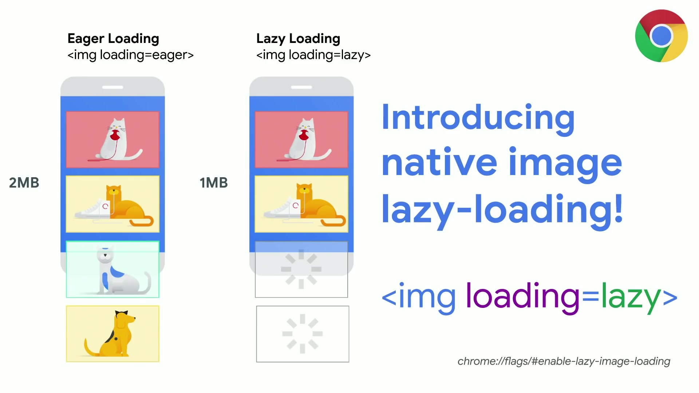

And also for iframes.


The new attribute `loading` will allow to choose if we want to apply the lazy loading behavior (eg ``) or not (eg ``). A third value will be `auto`, which will let the browser choose the mode.

This way it is not necessary to implement lazy loading using Javascript and we can save data and achieve substantial performance improvements.

When lazy loading the browser will request iframes and images that are in the viewport and will also make partial requests to the following images that are outside the viewport. These partial requests have an approximate size of 2kB and let the browser know the size of the image in pixels to create placeholders and avoid reflows.

## New Speed Report in Google Search Console

_Presented in [Demystifying Speed Tooling](https://www.youtube.com/watch?v=mLjxXPHuIJo?t=943)._

Google Search Console (former Webmaster Tools) includes a new report called Speed ​​Report. It is based on [FCP](https://developers.google.com/web/tools/lighthouse/audits/first-contentful-paint) and [FID](https://developers.google.com/web/updates/2018/05/first-input-delay) from _field metrics_.

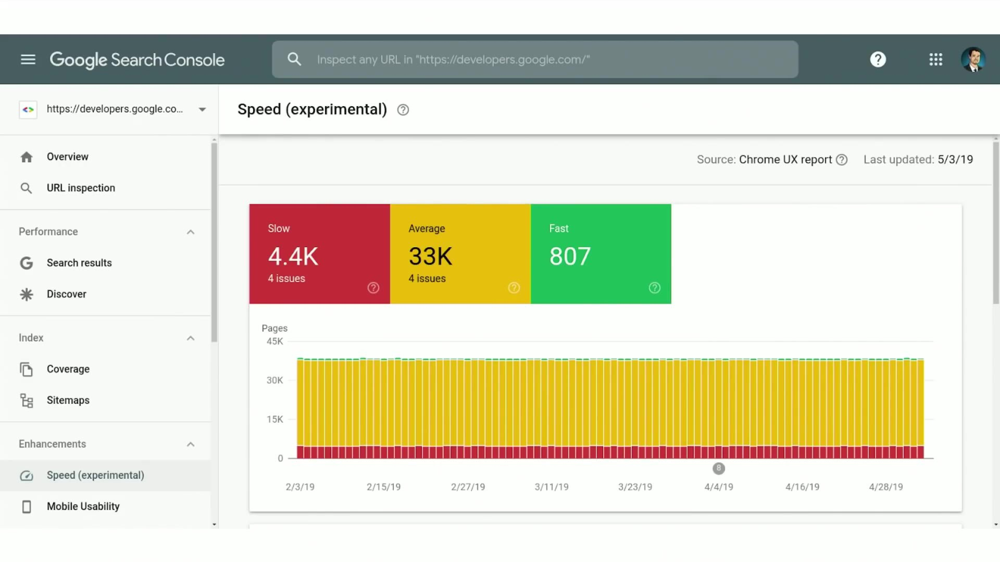

The report is useful to monitor the progress of these metrics and their distribution (fast, medium, slow) over time. It reminds the CrUX dashboard but with a daily metric report instead of a monthly one.

In addition, the report helps prioritize what improvements to carry out. For this, all the URLs affected by the same problem are grouped, indicating the potential savings in time.

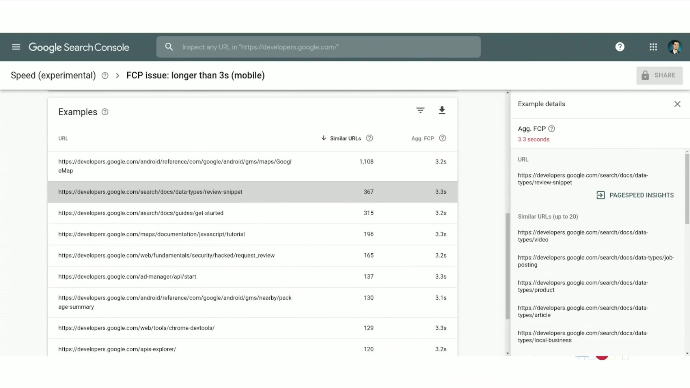

## Performance Budget Calculator

_Presented in [Speed at Scale: Web Performance Tips and Tricks from the Trenches](https://youtu.be/YJGCZCaIZkQ?t=226)._

The [Performance Budget Calculator](https://bit.ly/perf-budget-calculator) allows to forecast the Time To Interactive (TTI) of a page based on 2 metrics: size of JS resources and size of non-JS resources.

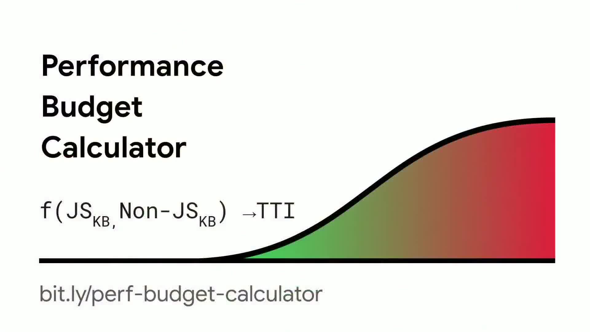

The calculations are based on the correlations that Google has found by analyzing data from 3.9 million pages using [HTTP Archive](https://httparchive.org/).

In addition, the calculator can create a `budget.json` file automatically to warn us when our code changes exceed the established thresholds.

## Firebase web performance monitoring

_Mentioned in [Demystifying Speed Tooling](https://www.youtube.com/watch?v=mLjxXPHuIJo?t=1630)._

It provides aggregations of real user performance metrics (RUM) for individual pages. The big advantage is that it shows distributions of the metrics, not just the average as it happens with Google Analytics.

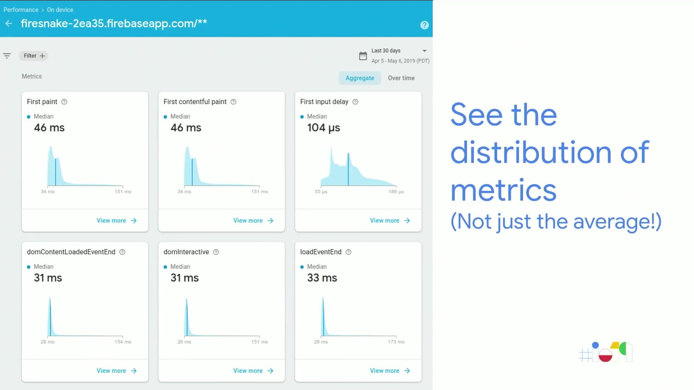

The metrics include First Paint, First Contentful Paint and First Input Delay. It is possible to filter by country and by type of connection among others.

To integrate the project, check out [this getting started guide](https://firebase.google.com/docs/perf-mon/get-started-web).

## Font-display support on Google Fonts

[font-display](https://developer.mozilla.org/docs/Web/CSS/@font-face/font-display) is a CSS feature that lets you control how fonts are loaded.

Google Fonts is used on many sites and, until now, there was no possibility to set the loading strategy of a font. Now, through the query parameter `display`, we can pass one of the supported values ​​and Google will apply it in the CSS rule that it returns.

The request

```bash
https://fonts.googleapis.com/css?family=Calligraffitti&display=swap
```

returns

```css
/* latin */
@font-face {
  font-family: 'Calligraffitti';
  font-style: normal;
  font-weight: 400;
  font-display: swap;
  src: local('Calligraffitti Regular'), local('Calligraffitti-Regular'), url(https://fonts.gstatic.com/s/calligraffitti/v10/46k2lbT3XjDVqJw3DCmCFjE0vkFeOZdjppN_.woff2) format('woff2');
  unicode-range: U+0000-00FF, U+0131, U+0152-0153, U+02BB-02BC, U+02C6, U+02DA, U+02DC, U+2000-206F, U+2074, U+20AC, U+2122, U+2191, U+2193, U+2212, U+2215, U+FEFF, U+FFFD;
}
```

Although `font-display: swap` is usually the most recommended option, other interesting options are` font-display: fallback` and `font-display: optional`, as Chris Coyier explains in [If you really dislike FOUT, 'font- display: optional 'might be your jam
](https://css-tricks.com/really-dislike-fout-font-display-optional-might-jam/). Also in CSS Tricks you will find the fantastic guide ['font-display' for the Masses](https://css-tricks.com/font-display-masses/).

## WebAssembly

_Presented in [WebAssembly for Web Developers](https://www.youtube.com/watch?v=njt-Qzw0mVY)._

This presentation has two parts. The first one where Surma talks about the use of WebAssembly in [Squoosh](https://squoosh.app/), a web-based image optimizer, that thanks to WebAssembly can use the codecs written in C and C++ to improve the speed of compression of the images. In the second, part Deepti talks about the proposals to be able to use several threads of execution in our applications.

Surma makes special emphasis that as web developers we should not worry about having to develop in C, C++ or Rust to work with WebAssembly, and presents [AssemblyScript](https://github.com/AssemblyScript/assemblyscript) that allows us to develop with [TypeScript](https://www.typescriptlang.org/).


With WebAssembly we will be able to improve the speed of execution of the Javascript applications, thus improving the user experience.
## Portals

_Presented in [From Low Friction to Zero Friction with Web Packaging and Portals](https://www.youtube.com/watch?v=Ai4aZ9Jbsys)._

[The new API Portals](https://github.com/WICG/portals) is a proposal that, although it is not directly related to improving the loading speed of our pages, it is in the perception that the user will have in the transitions between pages.

This API lets us load the destination page in an element similar to an iframe, and control the transition between the current page and the destination page.

<video controls autoplay loop muted style="max-width: 100%; height: auto">
  <source src="./thumbs/portals_vp9.webm" type="video/webm; codecs=vp8">
  <source src="./thumbs/portals_h264.mp4" type="video/mp4; codecs=h264">
</video>

_Embeds and seamless navegation with Portals. Created by [Adam Argyle](https://twitter.com/argyleink)._

On web.dev you'll find the post [Hands-on with Portals: seamless navigations on the Web](https://web.dev/hands-on-portals/) with more information and implementation examples.

## Conclusion

As we have seen, this edition of Google I/O came loaded with new tools around web performance.

Did we forget anything? [Tell us on Twitter @PerfReviews_.](https://twitter.com/PerfReviews_)
