Analizamos [la web de Renfe](http://www.renfe.com/). Una web con poco contenido pero con potenciales mejoras. Veremos estáticos sin minificar, duplicación de assets, combinación de recursos “a mano” y problemas de repintado producidos por librerías de tracking.

Aquí tienes nuestro análisis:
<iframe width="560" height="315" src="https://www.youtube.com/embed/pi02YqNHjJs" frameborder="0" allow="accelerometer; autoplay; encrypted-media; gyroscope; picture-in-picture" allowfullscreen></iframe>

----

<strong>¿Te gusta nuestro proyecto y quieres trabajar con nosotros?</strong>   Somos expertos en web performance y ofrecemos formaciones a equipos de desarrollo y auditorías de sitios web. <a href="/servicios/">Más información sobre nuestros servicios</a>.

## Resumen del vídeo

En esta review hemos elegido [la web de renfe](http://www.renfe.com/). Es una web que históricamente ha recibido críticas por [sus problemas de accesibilidad](http://accesibilidadweb.dlsi.ua.es/?menu=accesibilidad-web-renfe), [usabilidad](https://www.mastermarketingdigital.com/everriculum/2017/06/10/hands-on-informe-de-usabilidad-renfe-app/) y [disponibilidad](https://www.elplural.com/politica/twitter-se-ceba-con-los-errores-en-la-web-de-renfe_103904102). Hasta ahora no habíamos visto un análisis de performance de su web, y como esto es lo que nos gusta hacer en Perf Reviews, decidimos ponernos manos a la obra.

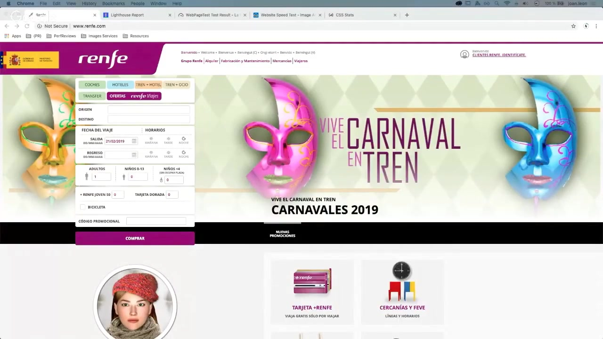

Decidimos hacer la revisión aprovechando el anuncio de que van a hacer ciertas mejoras en su web. Hay varias noticias al respecto sobre el cambio que van a hacer [e incluso el presupuesto](https://www.xataka.com/empresas-y-economia/que-700-000-euros-presupuesto-ridiculo-para-arreglar-web-renfe). Hay gente que le asusta esas cantidades y hay otros que dicen que no trabajarían en esa web por ese importe. Nosotros nos queremos centrar en hacer una revisión del rendimiento.

### Informes de Lighthouse, WebPageTest, Cloudinary y CSS Stats

Como suele ser habitual hacemos una primera pasada usando de [web.dev](https://web.dev). A nivel de performance la puntuación es muy muy baja.

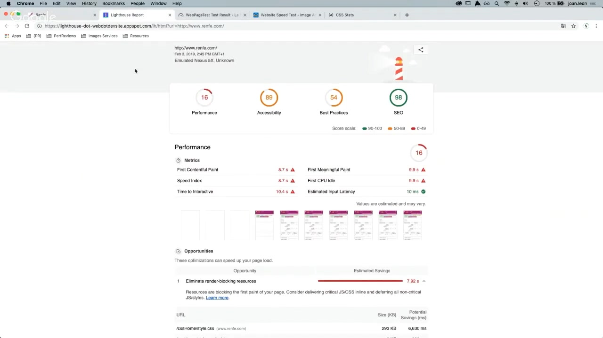

Los tiempos de First Contentful Paint se disparan a 8 segundos, el número de recursos que están solicitando, la forma en que está estructurado ese HTML para pedir esos recursos se pueden mejorar. En WebPageTest la parte negativa es principalmente el cacheo.

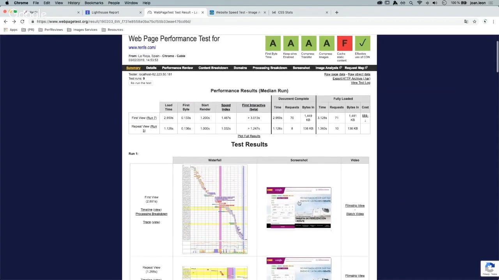

La web de Renfe en escritorio es relativamente rápida. Tampoco tiene mucho contenido: el formulario de venta, un slider, unas pocas imágenes y un menú. La home es relativamente ligera para un análisis de performance pero sí es verdad que en cuanto a la estructura y la arquitectura que tienen en el html y en las peticiones de los recursos veremos que hay bastantes puntos de mejora.

Las imágenes están bien, aunque se puede aumentar su compresión bastante manteniendo el formato JPG.

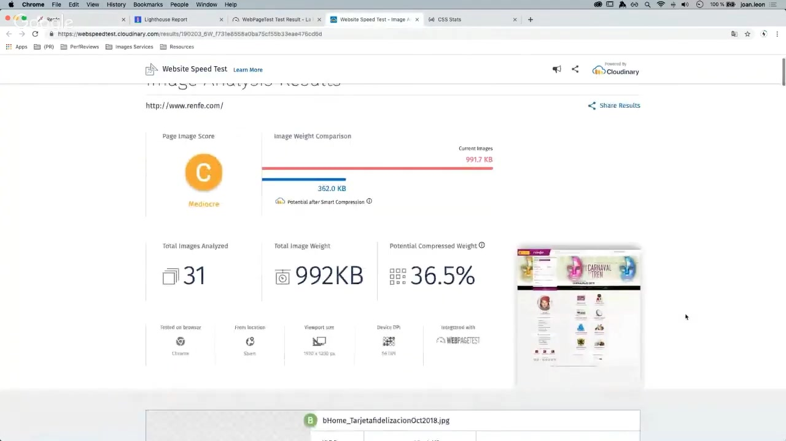

La mayoría de imágenes se están sirviendo al tamaño  adecuado. Hay varias imágenes como el logo de Renfe y varios iconos que podrían convertirse a SVG. En móvil las imágenes del slider se cortan.

Son imágenes de 1600 píxeles de ancho y están maquetadas para que la parte central de la imagen sea la que tiene el contenido con el texto. Aquí estaría bien que utilizasen responsive images para servir imágenes que se adapten al dispositivo y no hacer peticiones a imágenes de gran tamaño. Además, las imágenes se referencian en el HTML, lo que no permite hacer lazy loading, solicitando todas las imágenes al cargar la página.

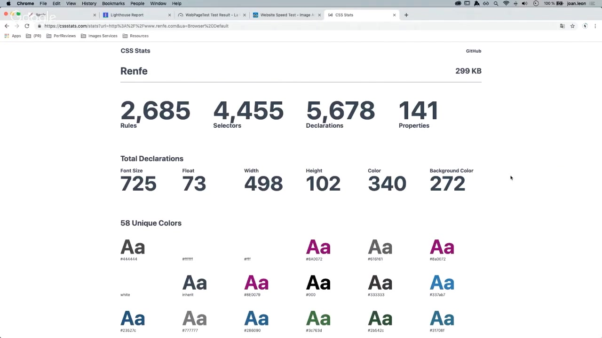

El estado del CSS es relativamente positivo. Tiene una especificidad en forma de sierra, lo que se puede interpretar como que conforme va pasando el tiempo se han ido añadiendo selectores más específicos para sobreescribir lo anterior. Más adelante explicaremos algunos CSS que se sirven sin minificar.

### Redirecciones y falta de SSL

Una de las cosas que llama la atención en Renfe es que el dominio no hace una redirección uniforme. Renfe.es no funciona, pero www.renfe.es sí, redirigiendo a renfe.com. La página principal no se sirve usando HTTPS. Este es un punto de mejora, ya que aparte de mejorar la seguridad e integridad de los datos permite implementar una serie de mejoras como service workers o http/2 que sólo funcionan sobre HTTPS.

La web de venta a la que el usuario llega después de elegir origen y destino sí soporta HTTPS.

### Falta de minificación y combinación

Si analizamos los estáticos vamos a ver que hay CSS y JS sin minificar.

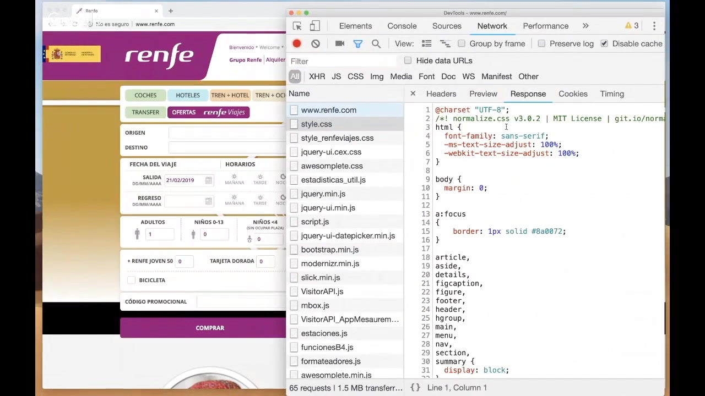

Librerías como jQuery y jQuery UI por lo menos sí lo están. Hay ficheros que son el resultante de una combinación "a mano" de 2 estáticos.

En general la gestión de estáticos de la web de Renfe parece que se ha congelado en el tiempo, pero bastante atrás en el tiempo. No usan ningún tipo de herramientas para minificar o para combinar los estáticos y los ficheros se han ido añadiendo al HTML sin mucho cuidado.

Se solicitan 4 recursos CSS sin combinar, y hace que el navegador tenga que esperar a que se descarguen para poder empezar a pintar.

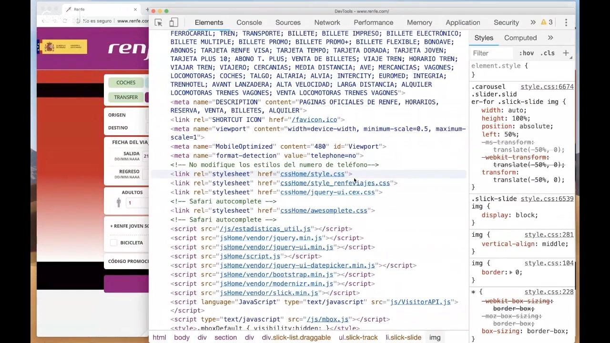

Encima, justo después del CSS se piden recursos JS, con lo que el navegador no va a poder empezar a renderizar nada porque la request al JS va a bloquear el renderizado del contenido que está en el body. Son una serie de recursos que se están añadiendo en el critical path que va a hacer que nuestro contenido tarde mucho en cargar.

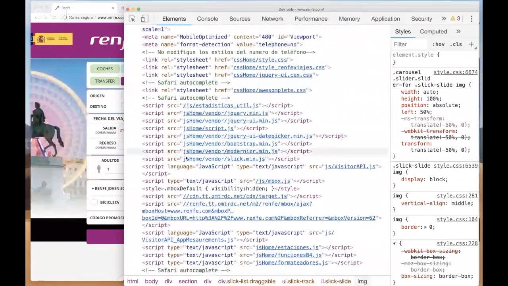

### Código condicional
Hay detalles como por ejemplo el awesomplete.css que parece ser que sólo se aplica a Safari, o esa era la idea que tenían, y también hay un awesomplete.min.js que es la parte de JS de [esa librería](https://leaverou.github.io/awesomplete/), que es un auto completado que desarrolló [Lea Verou](https://twitter.com/leaverou). Si lo estaban sirviendo sólo para Safari, una buena solución es comprobar el navegador que está haciendo la petición. Aunque tampoco hay que abogar mucho por hacer la detección de user agent en el lado del servidor y deberíamos usar feature detection en el lado del cliente.

### Código comentado

Hay mucho código comentado en el CSS y en JS. A veces parece que no hay ni siquiera una herramienta de control de versiones del código fuente.

En otro fichero se lee "todo esto tampoco va" seguido de un código comentado.  Este código se puede eliminar y dejar de servirlo al navegador.

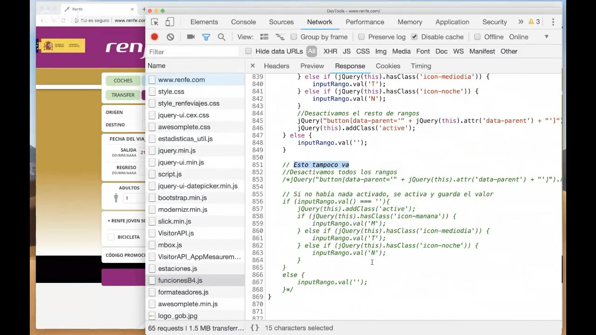

Hay también comentarios que son un pseudo changelog, con las fechas en las que se han hecho cambios en los ficheros. Esta información debería ir a un control de versiones.

### Potenciales mejoras al servir los estáticos
Los estáticos JS podrían cargarse de forma asíncrona al final del body. No se utiliza CDN y se piden muchos recursos al mismo dominio, lo que combinado con no usar http/2 hace aumentar el tiempo de carga.

El tiempo de cacheo es muy corto. En algunos casos, como en las fuentes woff2, de 1 segundo. Además, combinado con ETags hace que siempre sea necesaria hacer una petición al navegador para recursos que podrían ser versionados y cacheados durante un periodo largo.

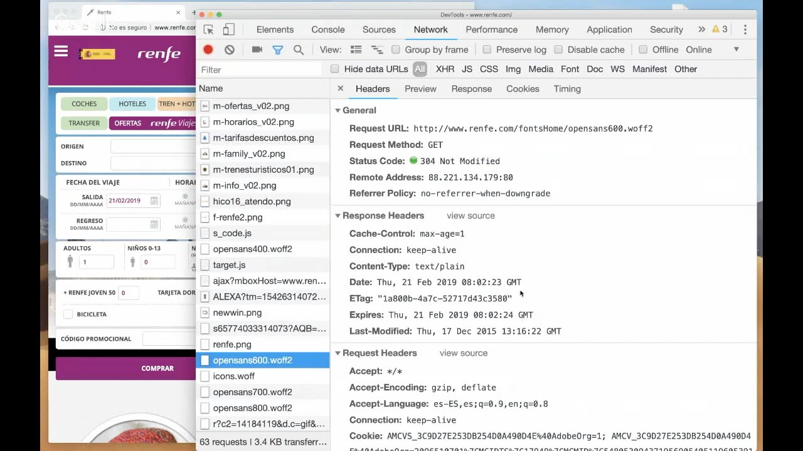

La imagen del logo de Renfe podría servirse en SVG e incluso hacerlo inline, dado que va a aparecer _above the fold_.

Los recursos están bien comprimidos pero el favicon.ico tiene un tamaño de 32 kb. Es bastante grande para ser un favicon, pero aparte de ello está sin comprimir. El formato ico es compresible así que no hay excusa para olvidar servirlo comprimido.

### Performance in-page
Al analizar la performance una vez cargada la página encontraos un timer que se está disparando constantemente.

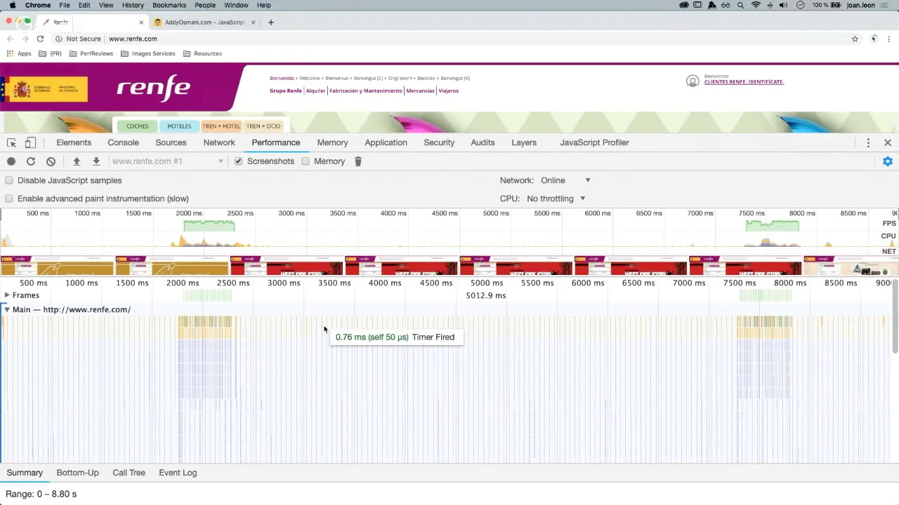

Es un tracker de Adobe que ejecuta una función cada 50 milisegundos un máximo de 18.000 veces, provocando cambios en 2 elementos del DOM principales.

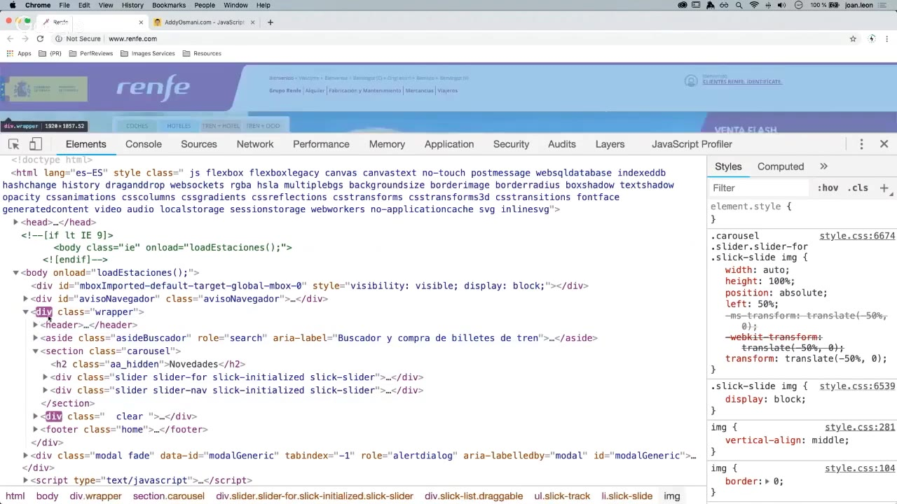

Una manera de comprobar que realmente es el tracker es bloquear la carga de recursos del dominio de ese archivo, en cuyo caso deja de aparecer el problema.

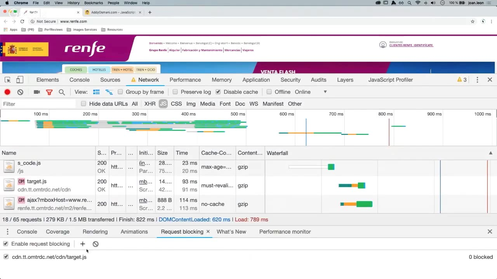

Además de analizar la página principal queríamos revisar la web de venta, la que se muestra al seleccionar un billete. Los recursos que se sirven son muy diferentes a los de la página principal. Se sirven desde diferentes ubicaciones, están versionados utilizando un query parameter...

Algunos ficheros tienen un contenido casi idéntico, pero en algún momento se hizo un cambio en uno de ellos y no se actualizó el otro. Esto es una fuente de problemas de inconsistencia y también previene reutilizar el archivo ya descargado cuando el usuario va desde la home hasta la página de venta.

El fichero de i18n tiene una extensa introducción listando todos los cambios desde 2009 hasta 2017. El archivo contiene todas las cadenas de texto en un código sin minificar. Aparte de minificar se podría hacer un split del fichero, dado que la mayoría de cadenas no se utilizan en la página actual.

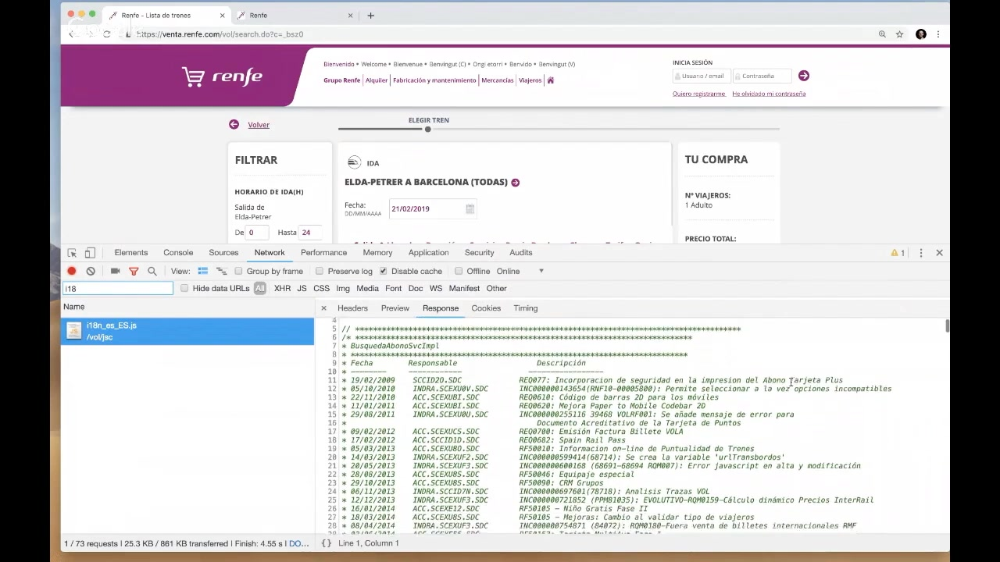

### Conclusión

Desde un punto de vista de la web performance hay muchos puntos de mejora. Se puede ver perfectamente que es un proyecto que se ha ido modificando durante el tiempo por diferentes equipos, y nunca se ha hecho un seguimiento desde un punto de vista global y de consistencia.

Esto ha sido todo esperamos que os haya gustado esta review. Como veis queríamos dar un punto de vista diferente a la hora de analizar la web de Renfe.

---

## Referencias

- [Por qué 700.000 euros es un presupuesto ridículo para "arreglar" la web de Renfe](https://www.xataka.com/empresas-y-economia/que-700-000-euros-presupuesto-ridiculo-para-arreglar-web-renfe)

## Informes

- [Lighthouse](https://lighthouse-dot-webdotdevsite.appspot.com/lh/html?url=http://www.renfe.com/)
- [WebPageTest desktop](https://www.webpagetest.org/result/190203_6W_f731e8558a0ba75cf55b33eae476cd6d/)
- [CSS Stats](https://cssstats.com/stats?url=http%3A%2F%2Frenfe.com&ua=Browser%20Default)

## Recurso

- [JavaScript Loading Priorities in Chrome](https://addyosmani.com/blog/script-priorities/) por Addy Osmani.
